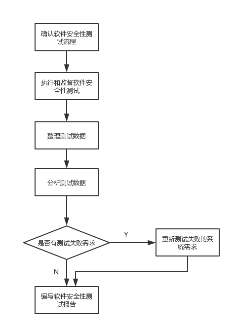
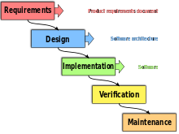
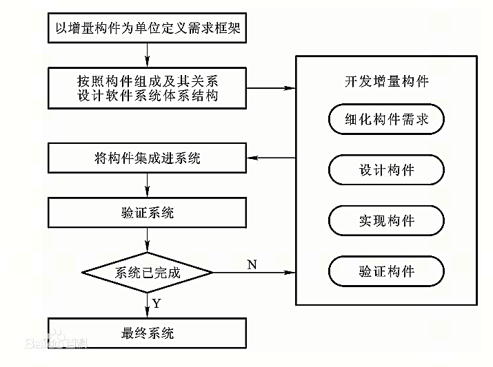
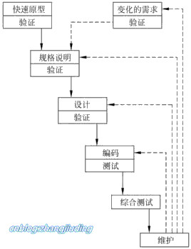
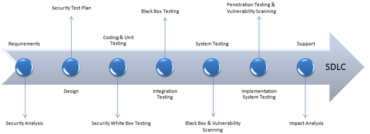
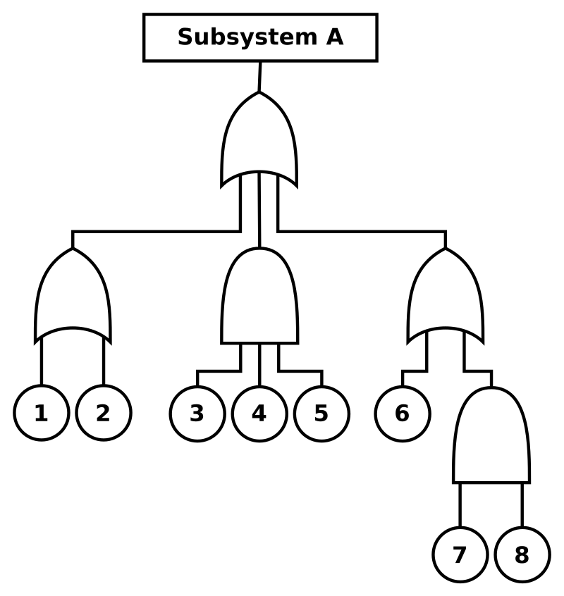
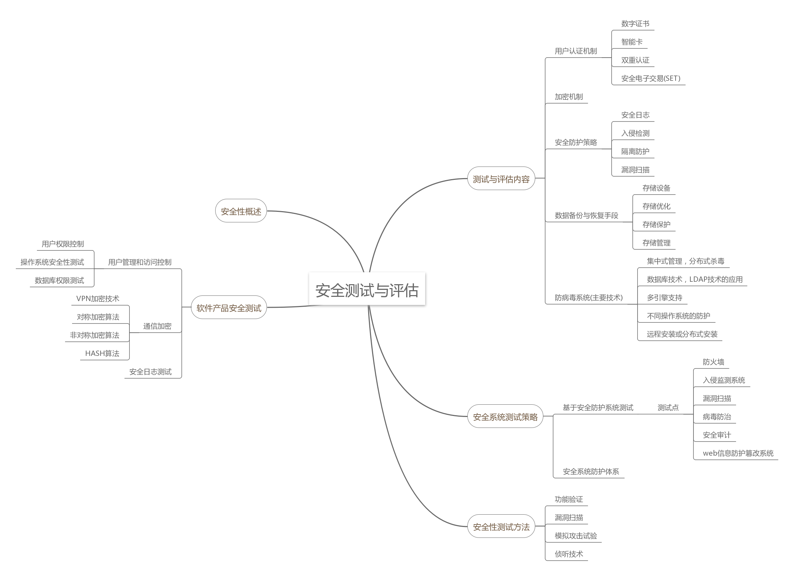

## 软件安全性测试自学报告

### 软件安全性测试

- 概念

  软件安全测试是一种软件测试，可确保软件系统和应用程序不受可能导致重大损失的漏洞，威胁和风险的影响。软件安全测试目的是确定软件的安全特性是否与预期设计的目标是一致的，包括安全功能测试，渗透测试和验证过程。通过在软件的生命周期内采取一系列的措施，测试软件安全性，防止出现违反安全策略的异常情况，发现在软件的设计、开发、部署、升级以及维护过程中的潜在的系统漏洞。软件安全性测试验证不安全的事情会不会发生，有没有安全性缺陷，如漏洞等等

  - 目标
    - 提高产品的安全质量
    - 尽量在软件发布之前找到安全问题并修复，避免发布后潜在漏洞造成的昂贵的修复成本

- 软件安全测试的重要性

  安全测试与软件质量相关，软件满足与功能特性相关的质量要求不意味着软件是安全的。当恶意的第三方利用软件的漏洞，可能导致：

  - 对软件品牌造成巨大损害
  - 丧失客户的信任和信心
  - 昂贵的修复成本
  - 法律制裁和民事诉讼

  适当的安全测试可以降低风险，评估软件安全性，机密性，真实性，脆弱性和连续性等各种安全要素

  

- 软件安全性测试流程

  软件安全性测试应该包括：

  - 验证软件安全性需求都有相应的软件安全性测试对应
  - 每个软件安全性需求都通过一个或多个测试得到满足
  - 通过测试分析和软件实现对相关发现进行评估
  - 判断给出的软件安全性测试已充足

  

  - 确定软件安全性测试规程：软件安全性工程师建立并检查规程，验证规程是否能完成测试软件安全性的需求
  - 执行和监督软件安全性测试：软件安全性团队监督软件安全性测试以确认软件安全性测试的规程并判断规程对软件安全性可能产生的异常影响
  - 整理测试数据：通过抽取测试期间记录的数据，推导性能和其它参数并表示为易于理解的显示信息来实现
  - 分析测试数据：数据抽取和分析的目的是标识安全性相关的异常和产生不安全的因素。这些因素可能是设计、实现、代码、测试用例、规程和测试环境中的错误
  - 重新测试失败的系统需求：在通常情况下，通过一次测试不能确认全部的软件安全性需求。在测试中仿真器，实验环境的局限可能使某些测试无法通过。因此，需要通过回归测试对功能的安全性提高充分的保证
  - 编写软件安全性测试报告：软件安全性测试报告必须标识所进行的测试，并分析测试结果。在测试结论中，软件安全性测试团队使用该结果以更新安全性需求标准中的需求可跟踪性矩阵，以及对系统和软件进行各种初步分析和详细分析。

- 特点

  - SDLC系统发展生命周期

    软件生命周期，用于描述信息系统从规划-->创建-->测试-->完成部署的全过程。系统(软件)发展生命周期由一系列明确定义的不同工作阶段组成，有助于系统(软件)工程师和系统（软件)开发人员利用对系统的设计，构造，测试和交付进行计划。SDLC的目标是根据客户需求生产满足或超过客户期望的高质量的系统或者是软件。SDLC模型包括：

    - 瀑布模型：

      

      开发过程按照顺序阶段式展开，每个步骤结束时，项目小组要进行审查，并决定是否进行下一步。强调产品的定义。各步骤分立而没有交叉，无法后退，一旦进入某一步骤，就要完成该步骤的任务，才能向下进行。

    - 敏捷软件开发：更注重软件开发过程中人的作用，更强调开发程序员团队与业务专家之间的紧密协作，面对面的沟通。通过频繁交付新的软件版本，紧凑而自我的组织型团队更好的适应需求变化的代码编写和团队组织方法

      敏捷软件开发描述了一套软件开发的价值和原则，在开发中，需求和解决方案都通过跨功能团队达成。主张适度项目，进化开发，提前交付和持续改进，使得开发和变更更加的快速灵活，有利于软件的持续进化

    - 增量模型：

      瀑布模型和原型进化模型的综合，从一组给定的需求开始，通过构造一系列的可执行中间版本逼近最终版本。第一个版本纳入一部分需求，下一个版本纳入更多需求直到系统完成，工作流程主要分为三个阶段：

      - 开发前期针对整个系统进行需求分析，确定系统中基于增量构建的需求框架，以此中构建的组成和关系为依据，完成对于软件系统的体系结构设计

      - 增量构件开发，对构件进行需求细化，进行设计，编码测试和有效性验证

      - 完成增量构件的开发后将构件集成到系统中，对改变后的系统进行有效性验证，进行下一个增量构件开发

        

    - 快速原型模型：

      

      在开发真实系统之前，迅速建造可以运行的软件原型，在原型的基础上逐渐完成整个系统的开发工作。建造快速原型实现客户和未来用户与系统的交互，客户和用户对原型进行评价从而细化待开发软件的需求。通过逐步调整原型确定并达到客户的要求。而后在原型基础上开发软件产品

    - 螺旋模式：

      

      兼顾快速原型的迭代的特征及瀑布模型的系统化与严格监控，引入风险分析，使软件在无法排除重大风险时停止从而达到减少损失的目的。为减小风险，螺旋模式在每个迭代阶段构建模型。

      螺旋模式通过建立原型使得软件开发在每个迭代的最初都有明确的方向；通过风险分析最大程度的降低软件出现重大失误彻底失败找出损失的可能性；在每个迭代阶段植入软件测试，使得每个阶段的质量得到保证；整体过程具备很高的灵活性使得开发过程的任何阶段自由应对变化；灭个迭代阶段累计开发成本，使得支出状况更容易被掌握并且通过阶段性的用户反馈，保证了用户需求的最大实现

  - 软件开发阶段安全测试

    

    | SDLC阶段       | 安全流程                                         |
    | -------------- | ------------------------------------------------ |
    | 要求           | 要求的安全性分析和检查滥用                       |
    | 设计           | 设计安全风险分析，制定包括安全测试在内的测试计划 |
    | 编码和单元测试 | 静态和动态测试和安全白盒测试                     |
    | 集成测试       | 黑盒测试                                         |
    | 系统测试       | 黑盒测试，漏洞扫描                               |
    | 履行           | 渗透测试，漏洞扫描                               |
    | 支持           | 补丁的影响分析                                   |

  - 软件安全测试与软件功能性测试的区别

    - 软件功能性测试主要是测试软件是否实现了该实现的功能，以正确的输入验证是否有正确是输出。不正确的输入/行为将之视为bug
    - 安全性测试是测试是否不做不应该做的事，应用输入测试有无不安全的事发生，安全性缺陷称为漏洞,常常由软件的副作用引起

- 软件安全性检测的分类

  - 安全功能测试

    基于软件安全功能的需求说明，测试软件安全功能的实现是否与安全需求一致，是否正确完备

    安全需求主要包括保密，完整性，认证，授权，可用性，不可否认性，访问控制，委托，隐私保护，安全管理，审计跟踪等

  - 安全漏洞测试
    发现安全漏洞。

    - 静态代码分析：一般的，安全漏洞的根本原因在于源代码本身。如，未经正确解析或处理输入的参数导致注入，缓冲区溢出或越界攻击。静态代码分析从源码的角度发现安全漏洞
    - 模拟功能攻击：许多安全攻击针对API的功能，例如将恶意SQL脚本注入查询参数，将无效数据作为表单输入发送或尝试二次跨站点脚本攻击，使用工具模拟攻击，评估软件是否易受攻击
      - SQL注入攻击：使用已知的SQL注入攻击来测试在数据库登录调用，查看是否可以在不提供口令的情况下登录
      - 跨站脚本攻击：尝试插入客户端脚本或恶意附件，并验证相应的web界面是否以无害的方式显示这些脚本或恶意附件
      - 模糊测试：随机的使用随机输入进行API调用，导致一些其它漏洞或错误信息泄露敏感系统信息

  - 黑盒安全性测试

    黑盒测试是软件测试的主要方法之一，测试者不了解程序内部的情况，不知道应用程序的代码，内部结构，使用的编程语言等信息，只知道程序的输入，输出和系统的功能。黑盒测试从用户的角度针对软件界面，功能以及外部结构进行测试，不考虑程序内部逻辑结构。

    黑盒安全性测试经过授权后设计成为攻击者的入侵模式，测试内部安全团队检测和应对一次攻击的能力，黑盒测试对技术要求较高，通常不要求找到所有安全漏洞

  - 白盒安全性测试

    又称透明盒测试，结构测试。测试基于程序本身，以编程语言的角度设计测试案例，测试者输入数据验证数据流在程序中的流动路径，并确定适当的输出。测试者了解待测试程序的内部结构，算法等信息，这是从程序设计者角度对程序进行测试。

    使用白盒安全性测试，测试者拥有所有的软件内部知识，可以在不用害怕被中断的情况下任意实施破坏以进行安全性测试，使用白盒安全性测试的最大问题是无法有效的测试客户组织的应急响应程序，无法判断安全防护计划对检测特定攻击的效率。

  - 灰盒安全性测试

    灰盒测试介于白盒测试和黑盒测试之间。由方法和工具组成，这些方法和工具取决于应用程序的内部知识和与它交互的环境。

    灰盒测试多用于集成测试阶段，不仅关注输出，输入的正确性，还关注程序内部的情况。它不需要像百合测试那样详细的内部逻辑，数据流图等详细详细，但又比黑盒测试更关注程序的内部逻辑，常常是通过一些表征性的现象、事件、标志来判断内部的运行状态。

    灰盒安全性测试介于白盒安全性测试和黑盒安全性测试之间

- 软件安全性测试的主要工作

  - 全面检验软件在软件需求规格说中规定的防止危险状态措施的有效性和在每个危险状态下做出的反应
  - 在软件设计过程中用于提高安全性的结构，算法，冗余，中断处理，容错性等方案，对上述进行有针对性的测试
  - 在异常条件下测试软件，检测是否可能的单个或多个输入错误导致不安全状态
  - 用错误的安全性关键操作进行测试，验证系统对这些操作错误的反应
  - 对安全性关键的软件单元和软件部件，单独进行加强的测试，确认其满足安全性的需求

- 安全性测试的主要方法

  - 静态分析安全性测试

    静态分析在不执行代码的情况下对程序进程评估。通过将代码建模，进行词法分析，语法分析，语义分析，对程序控制流及数据流进行分析，产生测试结果。

    - 优点：
      - 对代码进行检查，可以发现问题的根源
      - 可以在开发早期发现问题
      - 当发现新的攻击时，可以对大量代码进行检查
    - 缺点：
      - 代码量大时，不易于检查
      - 普遍存在误报和漏报

    静态分析工具复杂，需要从语义上理解程序的代码，依赖关系，配置文件以及兼容性问题。还要保持一定的速度以及准确性，降低误报和漏报。编程语言的多样化及动态类型的语言进一步影响静态分析工具 的有效性和效率

  - 形式化安全性测试

    形式化方式是一种基于数学的技术，用于规范，开发，验证软件和硬件系统。进行数学分析有助于提高系统的可靠性和鲁棒性。形式化方法既有完备的数学基础，保证了形式化规格说明的精确性。形式化方法能精确而无二义性地描述对象，形式化安全测试可分为两类：

    - 定理证明

      将程序转换为逻辑公式，然后使用公理和规则证明程序是合法的定理

    - 模型检测

      针对有限状态迁移系统的高效自动验证技术，主要通过显式状态搜索或也是不动点计算来验证有穷状态并发系统的模态命题性质。

    形式化方法的缺点：

    - 开发形式规格说明费时费力，当应用形式化方法时，对于给定复杂度的问题，开发可能需要花费预期时间的三倍
    - 形式规格说明可读性差，不易于理解
    - 一般是针对某一对象进行描述
    - 形式化规格说明维护困难

    形式化方法一般只用于安全性要求很高的系统或软件

  - 基于模型的安全性测试

    基于模型的安全测试对软件的行为和结构建模以生成测试模型，由测试模型生成测试用例，进行安全测试。常见的模型由有限状态机，UML模型，马尔可夫链等。基于模型的安全性测试的适用范围取决于安全功能的建模能力，适用于对授权，访问控制等安全功能测试

    - 有限状态机：表示有限个状态及状态之间相互转移和动作等行为的数学模型，又称为有限状态自动机或状态机
    - UML模型：```Unified Modeling Language```,统一建模语言，是非专利的第三代建模和归约语言。UML是用于说明，可视化，构建和编写的开放方法。展现了一系列最佳工程实践，对于大规模，复杂系统进行建模特别是在软件架构层次建模有效
      - 功能模型：从用户角度展示系统功能
      - 对象模型：采用对象，属性，操作，关联等概念展示系统的基础和结构
      - 动态模型：展示系统内部行为
    - 马尔可夫链：离散时间马尔可夫链，是状态空间中经过从一个状态到另一个状态的转变的随机过程。该过程要求要具有“无记忆”的性质。下一状态的概率分布只有当前状态决定，在时间序列中它前面的时间都与它无关。

    

  - 基于语法的安全测试

    语法测试根据被测试软件的功能接口的语法生成测试输入，检测被测试软件对各类输入的响应。功能接口可以式命令行，环境变量，文件，套接字等等。

    语法测试的思想式软件的接口明确或隐含规定了输入的语法，语法可采用BNF或正则表达式，定义了软件接受的输入数据的类型，格式。

  - 基于故障注入的安全性测试

    在软件测试中，故障注入通过向测试代码引入故障来改进测试软件，特别是错误处理代码路径。故障注入为评测容错机制的一种有效的方法，针对应用与环境的交互，主要包括用户输入，文件系统，网络接口，环境变量等引起的故障。通过人为引入故障，加速系统发生故障失效的过程。通过故障注入函数强制使程序进入某种特定状态，有效模拟各种异常程序行为

    

    - 故障注入工具
      - FIAT
      - PERRATI
      - Xception

  - 模糊测试

    模糊测试是一种基于黑盒的随机性测试，用于发现软件，操作系统或网络中的编码错误和安全漏洞。通过向测试对象输入大量随机数据，试图使其崩溃。如果发现漏洞，可以使用称为模糊器的软件工具来识别潜在原因。模糊测试可以使用语法规则来产生正常的输入，也可以使用基于特定程序的输入并用试探法来指导输入变量的生成。

    模糊测试是不合逻辑的，只是产生杂乱的数据攻击程序。具有误报率低漏报率高的特点 

  - 基于属性的安全性测试

    基于属性的安全测试，确定安全编程规则，然后将规则进行编码作为安全性属性，利用此来验证程序代码是否遵守规则。

    基于属性的测试有针对性的测试目标软件的特定的安全属性，可满足安全属性的分类和优先级排序的要求，且部分与具体软件无关的属性规格说明可重用

    - 可行的自动化基于属性安全检测过程
      - 将安全属性形式化描述为有限状态自动机
      - 将待分析的代码模型化为下推自动机
      - 利用模型验证技术确定模型中的任何一个违反安全属性的状态在程序中是否可达

  - 基于风险的安全性测试

    风险是错误发生的可能性和造成的危害程度的结合。基于风险的安全测试以软件安全风险作为测试的出发点和主要依据。将风险分析、管理、安全测试以及软件开发过程统一，在软件开发各个阶段都将有风险的安全漏洞考虑在内，达到将安全测试和软件开发同步进行的目的。

    基于风险的安全测试以软件模块的质量风险为主要参考依据，通过误用模式，异常场景，风险分析及渗透测试等技术处理具有风险的安全问题。实现尽早发现尽可能多的潜在安全问题并以最少的资源，最短的时间有效达到用户需求，并确保合适的软件品质以避免大量的后期维护工作

  - 基于渗透的安全性测试

    渗透测试是测试计算机系统，网络或web应用程序以查找攻击者可能利用的安全漏洞的实践。安全测试工程师模仿黑客特定的攻击行为，使用的漏洞发现技术和攻击手段，对目标的安全性做深入的探测，发现薄弱环节

    - 渗透测试分为主动测试和被动测试
      - 主动测试：直接侵入目标系统或网络内部收集信息
      - 被动测试：不直接进入目标系统，收集信息
    - 渗透测试的步骤：
      - 收集信息
      - 制定渗透策略
      - 进行漏洞测试，模拟真实攻击过程
      - 整理收集到的信息并提交测试报告

  - 基于故障树的安全性测试

    - 故障树分析:由上往下的演绎式失效分析法，利用布林逻辑组合低阶事件，分析系统中不希望出现的状态。故障树法将系统故障形成原因按树状细分。主要用于安全工程及可靠工程领域，分析系统失败原因并找到最好的方法降低风险或者确认某一安全事故过特定系统失败发生的概率

    - 故障树安全测试：利用故障分析树和故障树的最小割集输出安全性测试使用的测试用例，基于故障树，可以显著提高测试的自动化程度，对于大型复杂的系统测试由于其具有具体侧重性，能够有效的提高测试的效率，并且能充分的进行安全测试

    - 故障树

      - 顶事件：故障分析树的根，是系统最不希望发生的事件
      - 中间事件和底事件：寻找导致这一故障发生的全部原因
      - 倒立树状图形：表示顶事件和低事件之间的逻辑关系
      - 故障图用相应的事件符号代表事件，并用适当的逻辑门符号把顶事件，中间事件和底事件进行连接

    - 最小割集

      障碍树中，底事件同时发生能引起顶事件发生的底事件的集合。如果去掉这个集合中的某一个底事件都会使顶事件不再发生，则这个集合是最小割集
    

  - 安全性测试方法特点比较

    | 测试方法               | 特点                                                         |
    | ---------------------- | ------------------------------------------------------------ |
    | 静态分析测试           | 无需运行代码，易于实现自动化，可通过代码可以找到问题的根源。存在漏报和误报，具有不可判定性 |
    | 基于模型的安全测试     | 根据被测试软件设计，输出测试模型和测试用例，较大提高了测试现代化和效率。部分解决了测试失效辨识问题 |
    | 基于故障注入的安全测试 | 人为将错误引入系统，加速系统的失败，测试系统的容错性         |
    | 模糊测试               | 使用语法规则随机生成程序输入，或对输入进行编译后用于测试程序响应以发现程序安全漏洞，代码覆盖率不高 |
    | 基于属性的安全测试     | 创建安全规则，把规则编码为安全属性，再使用人工或自动化的方法来验证程序是否违反这些安全规则 |
    | 形式化安全测试         | 具有严格的数学基础，可根据形式规则生成测试用例并进行正确性证明 |
    | 基于风险的安全测试     | 以软件模块的质量风险为依据，再软件开发生命周期中进行测试力量的合理分配 |
    | 基于渗透的安全测试     | m模仿黑客行为对主机或网络进行攻击，具有真实性，对技术要求较高，覆盖率不高 |
    | 基于故障树的安全测试   | 使用故障树分析发生某一故障需要具备的因素或因素的组合，故障树安全测试具有充分性 |

- 安全测试与评估

  

- 软件系统安全性测试列表

  | 主题                 | 项目列表                                                     |
  | -------------------- | ------------------------------------------------------------ |
  | 软件安全性及测试方法 | 软件系统的安全性<br>系统安全规范和标准<br>源代码审计方法<br>基于风险的安全测试<br>渗透性测试方法<br>模糊测试方法 |
  | 代码安全性检验       | 源代码安全性<br>C++/Java安全性列表<br>JavaScript安全性列表<br>代码安全性扫描工具 |
  | web安全性测试        | 动态跟踪元素属性<br>检测JavaScript事件<br>跨站脚本攻击（XSS）<br>跨站请求伪造攻击（CSRF）<br>拒绝服务攻击（DoS）<br>Cookie劫持<br>输入验证<br>浏览器安全问题<br>文件上传风险<br>Web服务器端安全性<br>MS IIS 漏洞检验<br>Apache /Tomcat/...漏洞检验<br>内容安全性<br>会话管理<br>截获和修改post请求<br>SQL注入及其实例<br>AJAX安全性测试<br>多系统单点登录机制<br>渗透性Web安全测试<br>使用工具扫描SQL注入漏洞<br>使用Firebug观察实时的请求头<br>使用Webscarab观察实时的post数据<br>使用Tamperdata观察实时的响应头<br>使用curl检验URL重定向攻击<br>使用nikto扫描网站<br> |
  | 系统功能安全性验证   | 口令安全性<br>身份验证<br>用户权限<br>非授权攻击<br>访问控制策略<br>操作日志检查<br>配置管理<br>功能失效，异常带来的安全风险 |
  | 数据安全性验证       | 数据编码认证<br>数据加密和解密<br>系统数据完整性<br>数据管理性<br>数据独立性<br>数据备份和灾难恢复 |
  | 网络和通信安全性检验 | 协议一致性验证<br>防火墙<br>入侵检测技术<br>网络拦截<br>IPSec/SSL VPN<br>PKI/CA<br>网络漏洞检查工具 |


- 软件安全测试的发展方向
  - 测试流程规范化，通用化：在研究中对软件流程进行充分分析，提出规定化，通用化的测试流程，满足软件安全性测试的需求
  - 测试方法实用化，多样化：通常的软件安全性测试方法多样，涵盖可靠性，形式化方法。在多样化发展的同时，软件安全性测试也要向实用性方向演进
  - 测试策略合理化，综合化：测试方法的多样性增加了测试策略制定 的难度和工作量。所以，在软件安全性测试策略的研究和使用方面 ，应综合多种测试方法的优点以提出合理的测试策略，提高测试用例生成和执行的效率，保证测试的全面性，兼顾全面与效率 
  - 测试理论模型化，工程化：向模式化方向发展，同时提高测试的自动化个执行效率。并且，将软件安全性测试理论工程化，实现与软件安全性工程的融合，满足工程的需求。

## 参考资料

-  [Fuzz test](https://searchsecurity.techtarget.com/definition/fuzz-testing)
-  [wiki Fault-injection](https://en.wikipedia.org/wiki/Fault_injection)
-  [wiki penetration testing](https://en.wikipedia.org/wiki/Penetration_test)
-  [pen test (penetration testing)](https://searchsoftwarequality.techtarget.com/definition/penetration-testing)
-  [PEACH FUZZER](http://community.peachfuzzer.com/v3/PeachPit.html)
-  [Security Vulnerability Testing](https://www.soapui.org/learn/security/security-vulnerability-testing.html)
-  [软件发展生命周期](https://zh.wikipedia.org/wiki/%E7%B3%BB%E7%BB%9F%E5%8F%91%E5%B1%95%E7%94%9F%E5%91%BD%E5%91%A8%E6%9C%9F) 
-  [瀑布模型](https://baike.baidu.com/item/%E7%80%91%E5%B8%83%E6%A8%A1%E5%9E%8B)
-  [增量模型](https://baike.baidu.com/item/%E5%A2%9E%E9%87%8F%E6%A8%A1%E5%9E%8B)
-  [螺旋模型](https://zh.wikipedia.org/wiki/%E8%9E%BA%E6%97%8B%E6%A8%A1%E5%9E%8B)
-  [敏捷软件开发](https://zh.wikipedia.org/wiki/%E6%95%8F%E6%8D%B7%E8%BD%AF%E4%BB%B6%E5%BC%80%E5%8F%91)
-  [快速原型模型](https://baike.baidu.com/item/%E5%BF%AB%E9%80%9F%E5%8E%9F%E5%9E%8B%E6%A8%A1%E5%9E%8B)
-  [黑盒测试](https://zh.wikipedia.org/zh-cn/%E9%BB%91%E7%9B%92%E6%B5%8B%E8%AF%95)
-  [白盒测试](https://zh.wikipedia.org/wiki/%E7%99%BD%E7%9B%92%E6%B5%8B%E8%AF%95)
-  [what-is-security-testing](https://www.guru99.com/what-is-security-testing.html)
-  [Software_Security_Testing](http://staff.ustc.edu.cn/~sycheng/sst/lectures/ch10_Software_Security_Testing.pdf)
-  [形式化方法和测试技术及其在安全中的应用](http://www.cqvip.com/read/read.aspx?id=23268924)
-  [故障树分析](https://zh.wikipedia.org/zh-cn/%E6%95%85%E9%9A%9C%E6%A8%B9%E5%88%86%E6%9E%90)

